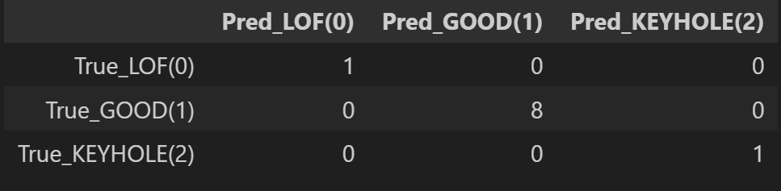
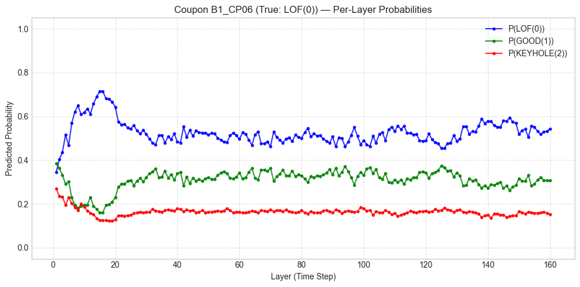
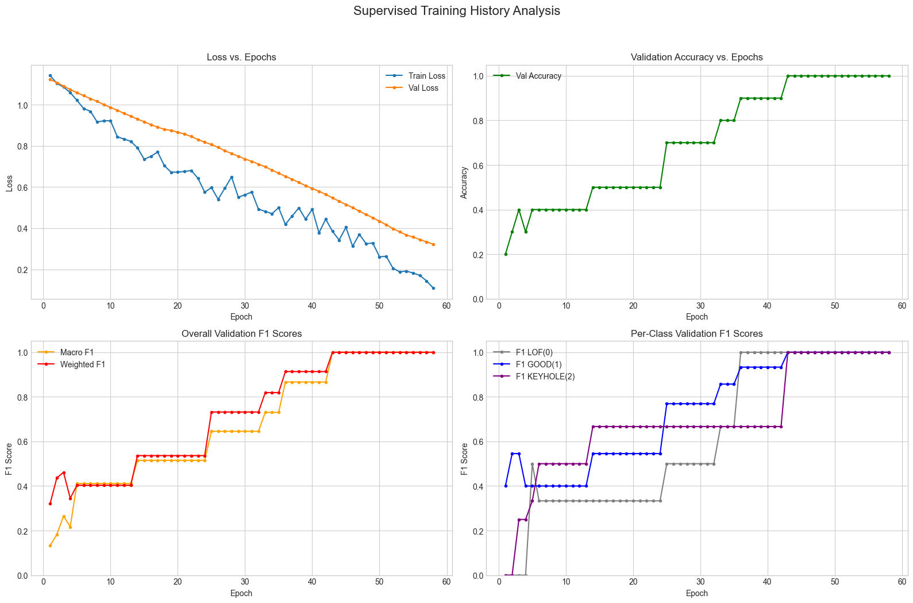
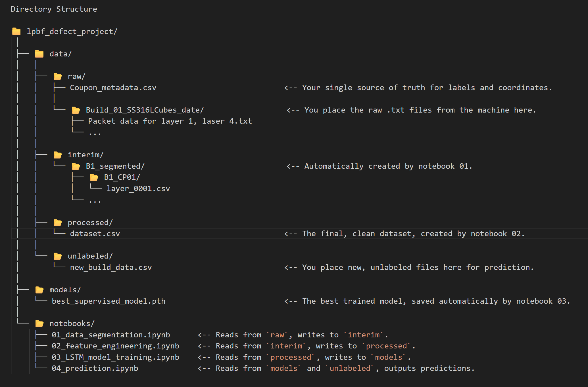

LPBF Defect Detection Project
This project uses sensor data from a Laser Powder Bed Fusion (LPBF) process to train an LSTM model for in-situ defect detection. The project is divided into four main stages, each corresponding to a Jupyter notebook, which process the data from its raw state to a final prediction.

## 🖼️ Results & Visuals

The trained LSTM model achieved classifying defective coupons. The confusion matrix below shows the model's performance on the test set, highlighting its ability to distinguish between good, Lack of fusion , and keyhole parts.

**

---

## 🛠️ Technologies Used

* **Python 3.10**
* **Data Processing**: Pandas, NumPy
* **Machine Learning**: PyTorch, Scikit-learn
* **Data Visualization**: Matplotlib, Seaborn
* **Notebooks**: Jupyter Notebook

Project Structure
The project follows a modular structure to separate data, notebooks, and models.

- data/raw: Contains the raw sensor data and metadata (Coupon_metadata.csv).
- data/interim: Stores segmented data after initial processing from the first notebook.
- data/processed: Holds the final feature-engineered dataset (dataset.csv).
- data/unlabeled: A directory for new data you wish to make predictions on.
- models/: Saves the trained model checkpoint (best_supervised_model.pth).
- notebooks/: Contains the Jupyter notebooks for each project stage.

Setup Instructions
To set up the environment and run this project, please follow these steps.
1. Python Version
This project was developed using Python 3.10.6. It is highly recommended to use the same version to ensure compatibility.
2. Create a Virtual Environment (Recommended)
It's best practice to use a virtual environment to manage project dependencies.
# Create the virtual environment
python -m venv venv

# Activate the environment
# On macOS/Linux:
source venv/bin/activate
# On Windows:
venv\Scripts\activate

3. Install Dependencies
Install all the required Python libraries using the requirements.txt file. 

pip install -r requirements.txt

How to Run the Notebooks
The project notebooks are designed to be run in a specific order. Follow these steps to execute the project from start to finish.
1. 01_data_segmentation.ipynb
Purpose: This notebook reads the raw sensor data, segments it into coupon-specific regions based on the provided metadata, and saves the segmented data into coupon-specific subfolders within the data/interim directory.
Instructions: Before running, ensure your raw data files and the Coupon_metadata.csv are placed in the data/raw directory. Then, execute all cells in the notebook.

2. 02_feature_engineering.ipynb
Purpose: This notebook processes the segmented data from the interim folder, calculates a wide range of statistical and spatial features for each layer, and creates the final dataset.csv file in the data/processed directory.
Instructions: Run this notebook only after the data segmentation is complete. Execute all cells to generate the final dataset ready for model training.

3. 03_LSTM_model_training.ipynb
Purpose: This notebook loads the processed dataset, trains a Long Short-Term Memory (LSTM) model to classify coupons based on their layer-wise features, and saves the best-performing model to the models directory as best_supervised_model.pth.
Instructions: Ensure dataset.csv exists in the data/processed directory. Execute all cells to train the model. The notebook will also output performance metrics and visualizations.

4. 04_prediction.ipynb
Purpose: This notebook demonstrates how to load the trained LSTM model and use it to make predictions on new, unlabeled data.
Instructions:
Place your new data file (which should have the same column structure as the original dataset) into the data/unlabeled directory.
In Cell 2 of the notebook, update the NEW_DATA_FILENAME variable to match your file's name.
Execute all cells to see the coupon-level and layer-wise predictions for your new data.
